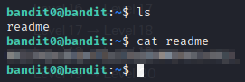

Bandit0
---
---
### This machine is pretty easy. You just need to know how to connect to a Linux machine using SSH
---

**username: bandit0**   
**password: bandit0**

Once I logged in, I did a quick ***ls*** and found readme file. There's a flag in it

This flag is the password for the next level :)