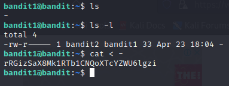

# bandit1
---
### Flag obtained in **bandit0** is a password, which is used to SSH into **bandit1**  
  
1. Once I logged into **bandit1**, performed a quick **ls** and found a file whose name is **-**  
2. This is the only tricky part in this exercise. Once I tried to use `cat -` I came to know that this is not possible
to read the contents of this file using a traditional way. At this point I thought that I might need to look for a hidden file using `ls -al` but did not find anything useful.
3. A quick google search results in [this](https://www.golinuxcloud.com/overview-bash-dashed-filename-directory-linux/) where I found that there's a way to **cat** into ***dashed*** files :)  
`cat < -`  
Voila! Flag found. Now to the next level.

    