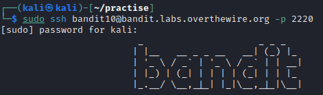
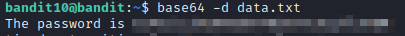

# bandit10

### Solution Steps:

1. Save the flag which was obtained from **bandit9**. This flag is actually the password to SSH into **bandit10**.
2. Now establish an SSH connection using `sudo ssh bandit10@bandit.labs.overthewire.org -p 2220`.
   
   

3. Following are the clues which are given to us:
   * Password for the next level is stored in a file named **data.txt**.
   * This file contains **base64** encoded data.
4. Now we can use **base64** command to simply encode or decode the data. Now here because the data is already encoded so to decode this data we can use **-d** switch as follows:
   > `base64 -d filename`

5. Save this flag because it will be used to login to the next level.
6. Thank you for your time. See you in next level :)