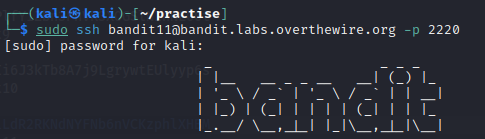
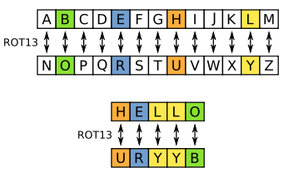
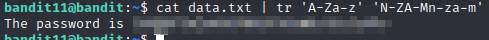

# bandit11

### Solution Steps:

1. Save the flag which was obtained from **bandit10**. This flag is actually the password to SSH into **bandit11**.
2. Now establish an SSH connection using `sudo ssh bandit11@bandit.labs.overthewire.org -p 2220`.
   
   

3. Following are the clues which are given to us:
   * Password for the next level is stored in a file named **data.txt**.
   * Where all lowercase (a-z) and uppercase (A-Z) letters have been rotated by 13 positions

4. There are 2 ways to solve this problem. First one is to simply visit [rot13.com](https://rot13.com/) and enter the data which is available in **data.txt**
5. But to satisfy my curiosity, I used another way to do this on terminal itself.
6. **tr** command is used to translate characters from any given set of characters to another set. For example if you want to replace a space character, from a given text, with a tab character, you can use following command:
   > `echo "this is sample text | tr ' ' '\t'"`
7. Now the requirement here is to convert **rot13** encrypted text into normal human readable text. ROT13 is an encryption method in which the place of each character is shifted by 13 places.
   

8. Now to convert the text which is available in **data.txt**, we will use following command:
   > `cat data.txt | tr 'a-zA-Z' 'n-za-mN-ZA-M'`

   

9. Save this flag for the next level :)
10. Thank you for your time and see you in next level :)