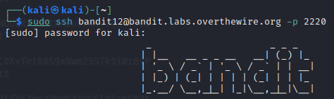
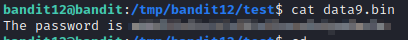

# bandit12

### Solution Steps:

1. Save the flag which was obtained from **bandit11**. This flag is actually the password to SSH into **bandit12**.
2. Now establish an SSH connection using `sudo ssh bandit12@bandit.labs.overthewire.org -p 2220`.
   
   

3. Following are the clues which are given to us:
   * Password for the next level is stored in a file named **data.txt**.
   * This file is a hexdump of a file that has been repeatedly compressed.
   * For this level it may be useful to create a directory under /tmp in which you can work using mkdir. 
   * Then copy the datafile using cp, and rename it using mv (read the manpages!)
4. So far this was a tough level for me. It took me so much time to crack this level. Almost 2 hours, because I had no idea how to extract actual data from a hexdump file. Also data was compressed multiple times.
5. Along the way I learnt about following commands:
   * `xxd`
   * `hexdump`
   * `file`
   * `bzip2`
6. These are few of the commands which will be used to get the flag. Go and practise it and do let me know if you found the flag :)
    

