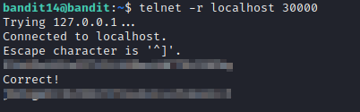

# bandit14

### Solution Steps:

1. Once you are successfully logged into **bandit14**, as described in previous machine, you can easily retrieve the password for next level by following few steps:
   1. Telnet on port **30000** on localhost

> ### What is localhost?  
> localhost refers to the machine on which you are currently working on. In our case it will be **bandit14**.  
> You can further read about localhost on wikipedia, [here](https://en.wikipedia.org/wiki/Localhost).

2. Telnet is a client/server application protocol which is used to connect to remote hosts. However, please note that this protocal is susceptible to man-in-the-middle attacks.
3. To connect using telnet, use the following command
   > `telnet -r localhost 30000`
4. Once you are connected, provide the password which was obtained from previous level. If the password is correct, you will find the password for next level from here :)

 
