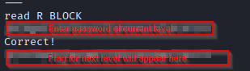

# bandit15

### Solution Steps:

1. Save the flag which was obtained from **bandit14**. This flag is actually the password to SSH into **bandit15**.
2. Now establish an SSH connection using `sudo ssh bandit15@bandit.labs.overthewire.org -p 2220`.
3. Here is our clue:
   * The password for the next level can be retrieved by submitting the password of the current level to port 30001 on localhost using SSL encryption.
4. To submit the password using SSL encryption, we will use **openssl**. In simple terms, Openssl is a utility which is used to perform certain tasks related to cryptography. To read more about openssl you can visit their wiki page [here](https://en.wikipedia.org/wiki/OpenSSL).
5. To submit our password using openssl, we will use the following command:
   > `openssl s_client -connect localhost:30001`
6. Once connected, submit the password which was used to login to current machine. If the password provided is correct, you will recieve the password to the next level :)
   

