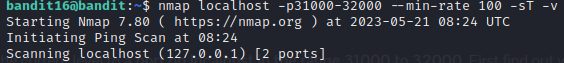
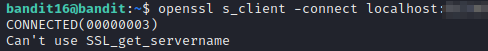

# bandit16

### Solution Steps:

1. Save the flag which was obtained from **bandit15**. This flag is actually the password to SSH into **bandit16**.
2. Now establish an SSH connection using `sudo ssh bandit16@bandit.labs.overthewire.org -p 2220`.
3. Following are the clues given to us:
   1. The credentials for the next level can be retrieved by submitting the password of the current level to a port on localhost in the range 31000 to 32000.
   2. First find out which of these ports have a server listening on them. 
   3. Then find out which of those speak SSL and which don’t. 
   4. There is only 1 server that will give the next credentials, the others will simply send back to you whatever you send to it (echo).
4. Now to find open ports on current host we can simply use nmap with -sT switch and for version detection we can use -sV switch as well. 
5. There are a total of 1000 ports which needs to be scanned. So to increase the speed we can use --min-rate switch and provide it with a suitable number, I used 50.
6. So final nmap command will look something like this:
   > `nmap -sT -sV -p31000-32000 --min-rate 50 localhost`

7. I found 5 open ports and out of those 5, 2 are listening for SSL connection. Only one of them will give you the credentials for next level.
8. Connect to that port using **openssl**, by using following command:
   > `openssl s_client -connect localhost:port_num`
   

9. Once you will provide the credentials for current level, you will obtain the private key to login to next level :)
10. Thank you for your time, see you in next level.