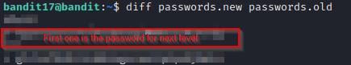

# bandit17

### Solution Steps:

1. Save the flag which was obtained from **bandit16**. This flag is actually the private-key to SSH into **bandit17**.
2. Now establish an SSH connection using `sudo ssh bandit17@bandit.labs.overthewire.org -p 2220 -i key_file_name`.
3. Following are the clues given to us:
   1. There are 2 files in the homedirectory: passwords.old and passwords.new.
   2. The password for the next level is in passwords.new and is the only line that has been changed between passwords.old and passwords.new
4. Simply to calculate the difference between two files we will use `diff` command like this:
   > `diff passwords.new passwords.old`
5. This will yeild two outcomes and one of them is the password for next level :)

