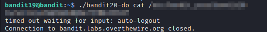

# bandit19

### Solution Steps:

1. Save the flag which was obtained from **bandit18**. This flag is actually the password to SSH into **bandit19**.
2. Now establish an SSH connection using `sudo ssh bandit19@bandit.labs.overthewire.org -p 2220`.
3. Here is our clue:
   1. A setuid binary is present in home directory.
   2. Execute it without arguments to find out how to use it.
   3. The password for this level can be found in the usual place (/etc/bandit_pass), after you have used the setuid binary.
4. What is setuid?
   setuid is a bit, which if set, enables a user to run a binary with a privileges of another user. Lets say there is a bash script which only a user1 can execute, if user1 enable its setuid bit, then any other user can execute that script with same privileges of user1.
5. In this task there is a file available in home directory and its setuid bit is set. Means we can execute this binary with similar privileges of a user to which this file belongs. 
6. `ls -al` reveals the ownership of this file. Now we have a clue which tells us that which file stores the password of the next level.
7. Using this binary execute the `cat` command on that file and you will get the password for the next level :)
   

 