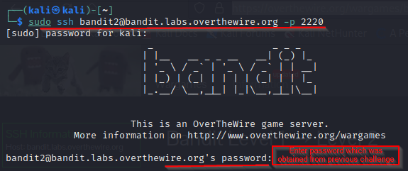
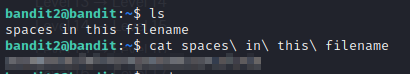

# bandit2

### Solution Steps:

1. Save the flag which was obtained from **bandit1**. This flag is actually the password to SSH to **bandit2**.
2. Now establish an SSH connection using `sudo ssh bandit2@bandit.labs.overthewire.org -p 2220`

   

3. If the password you entered is correct than you are successfully logged into **bandit2** machine.
4. A quick ls in the home directory for this user reveals a file named **spaces in this filename**.
5. I tried to cat this file and voila! flag obtained.

    
6. Don't forget to save this flag. This is the password for next level.
7. Thank you for your time! See you in next challenge :)