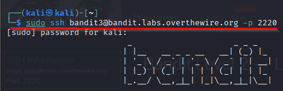
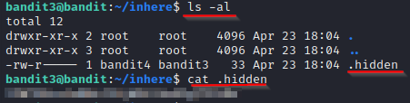

# [bandit3](https://overthewire.org/wargames/bandit/bandit3.html)

### Solution Steps:

1. Save the flag which was obtained from **bandit2**. This flag is actually the password to SSH to **bandit3**.
2. Now establish an SSH connection using `sudo ssh bandit3@bandit.labs.overthewire.org -p 2220`

    
3. The main purpose of this lab is to know how to find hidden files. If you put a period **.** at start of the filename than this linux system takes this file as a hidden file.
4. Once a file is hidden, it means that `ls` command won't list this file on the terminal.
5. You need to use a switch with `ls` command as `ls -al`.
6. Quickly we will visit (ExplainShell)[https://www.explainshell.com/] and see what is the meaning of this command.

    

7. In the */home/bandit3* directory you will find the directory named **inhere**.
8. `cd` to this directory and run `ls -al`.
9. You will find a file named **.hidden**.
10. `cat` this file using `cat .hidden`.
11. Congratulations! Flag found. Don't forget to save this flag for the next level.

    

12. Thank you for your time. See you in next [level](https://overthewire.org/wargames/bandit/bandit4.html) :)