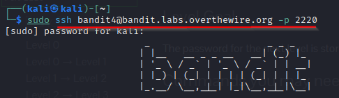
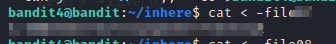

# [bandit4](https://overthewire.org/wargames/bandit/bandit4.html)

### Solution Steps:

1. Save the flag which was obtained from **bandit3**. This flag is actually the password to SSH to **bandit4**.
2. Now establish an SSH connection using `sudo ssh bandit4@bandit.labs.overthewire.org -p 2220`

   
3. After a successful login, a quick `ls` reveals that there is **inhere** directory available in **bandit4** home directory.
4. Try `cd` into this directory and OMG a quick `ls` yeilds all ***dashed*** files here. I think the developers of this CTF challenge just loves ***dashed*** files. Anyways, there are a total of **10** files available in **inhere** directory.
5. How to open a dashed file? Try using `cat -filename` and you will recieve this error.  
`cat: invalid option -- 'f'`  
`Try 'cat --help' for more information.`
6. The correct way of opening a **dashed** file is to use `cat < -filename`. This will show the contents of your file on terminal. 
7. Good luck in finding the actual file from all the files present in **inhere** directory.
8. Only one file has the correct flag which is in human-readable format. Remaining files just contain garbage data.
9. Once you find the flag, save it and use it to login on next machine.

      

10. Thank you for your time. See you in next [challenge](https://overthewire.org/wargames/bandit/bandit5.html) :)