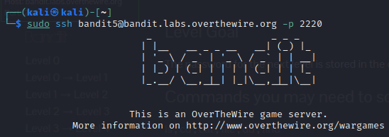
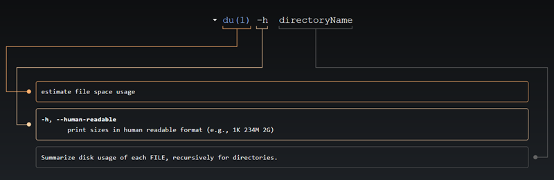
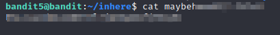

# bandit5

### Solution Steps:

1. Save the flag which was obtained from **bandit4**. This flag is actually the password to SSH into **bandit5**.
2. Now establish an SSH connection using `sudo ssh bandit5@bandit.labs.overthewire.org -p 2220`
   
   
3.  After a successful login, a quick `ls` reveals that there is **inhere** directory available in **bandit5** home directory.
4.  Once you will `cd` into **inhere** directory, here comes the challenging part. There are a total of 20 directories available and your human-readable password file is anywhere in these directories.
5.  I used the `du` command to find the sizes of all the directories. The assumption here is to find the least sized directory. Why? Because it will contain less garbage data :P 
6.  When I did this, I found 3 directories with smallest size of 52k. Command used is `du -h directoryName`. We will see on [explainshell](https://www.explainshell.com/explain?cmd=du+-h+directoryName) about what this command does.  
   
     

7. Clues available on challenge page shows that the file has below properties:
   1. human-readable
   2. 1033 bytes in size
   3. not executable
   4. Clue from my side, file is hidden :)

8.  Once you find the flag, save it and use it to login on next machine.  
      
9.  Thank you for your time. See you in next challenge.
    