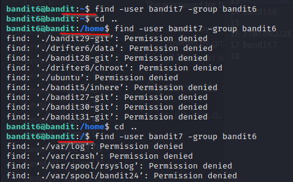
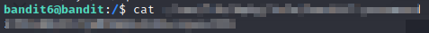

# bandit6

### Solution Steps:

1. Save the flag which was obtained from **bandit5**. This flag is actually the password to SSH into **bandit6**.
2. Now establish an SSH connection using `sudo ssh bandit6@bandit.labs.overthewire.org -p 2220`.
3. Following are the clues which are given to us:
   1. File is stored somewhere
   2. File is owned by user **bandit7**
   3. File is owned by group **bandit6**
   4. File size is 33 bytes
4. Once you logged into the machine you will land in the home directory of **bandit6**.
5. In this directory, there are no useful files or directories available.
6. I got to know this by googling, that we can `find` a file, if we know it's ownership details i.e. user and group.
7. Use `find -user username -group groupName`. This command will list all the files which are owned by user **bandit7** and group **bandit6**.
8. This command will also list most of the files where **permission is denied** i.e. with current permissions we are not allowed to access those files.
9. Also please note that we have to run this command in root directory to be able to get the required file.
10. Why is that so? The answer is that we do not know the actual location of the required file and the syntax of `find` command is as follows:
        ```find path_where_to_find -user username -group groupName```
11. If the path of file is unknown, or if we are not specifiying the path then find command tries to find the respective file in current directory. Refer to below ss which shows the results of `find` command run in **/home/bandit6** directory, then in **/home** directory and finally in **/** or **root** directory.
    
    

12. In root directory the results will show loads of files for which we do not have enough permissions to read.
13. Out of all those files there is only **one** file which we can read and this file contains our flag :)

    

14. Once you find the flag, save it and use it to login to next level.
15. Thank you for your time. See you in the next level :)
