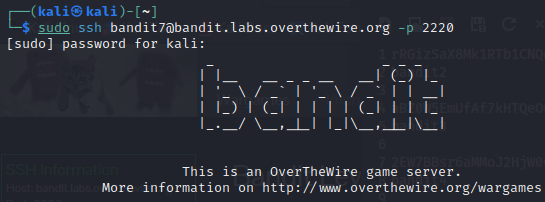
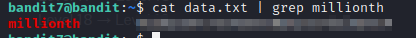

# bandit7

### Solution Steps:

1. Save the flag which was obtained from **bandit6**. This flag is actually the password to SSH into **bandit7**.
2. Now establish an SSH connection using `sudo ssh bandit7@bandit.labs.overthewire.org -p 2220`.
   
   

3. Following are the clues which are given to us:
   1. Password for the next level is stored in a file named **data.txt**.
   2. Next to the word **millionth**
4. Clues are very helpful. Don't get me wrong here. Why? Because when I logged into the machine and a quick `ls` revealed that **data.txt** file is waiting in the **/home/bandit7** directory for us to explore it :)
5. Now `cat` this file using `cat data.txt` and in a second you will understand the importance of second clue :D
6. To be successful in this level, we need to know a great painkiller linux command which is known as `grep`.
7. As per definition which I found on google:
   > Grep is a useful command to search for matching patterns in a file. grep is short for "global regular expression print"

8. We are lucky that we already know what to match here, yeah the word **millionth**. How?
9. Simply `cat data.txt` and **pipe |** the output to `grep millionth` and you will find your key to the next level.
10. Save this flag and use it to unlock the next level.
    
    

11. Thank you for your time. See you in the next level :)
