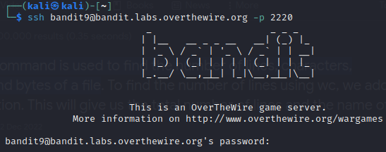

# bandit9

### Solution Steps:

1. Save the flag which was obtained from **bandit8**. This flag is actually the password to SSH into **bandit9**.
2. Now establish an SSH connection using `sudo ssh bandit9@bandit.labs.overthewire.org -p 2220`.
   
   

3. Following are the clues which are given to us:
   * Password for the next level is stored in a file named **data.txt**.
   * It is the only line of text which is in human readable form and starts with "=" sign

4. Just to satisfy my curiosity, I tried to open **data.txt** by using following command, and found that this contains binary data:
   > `cat data.txt`  

5. To extract human readable data, I used **strings** command and piped the result to grep command as follows:
   > `strings data.txt | grep "=="`

6. By using this command, I was able to get the flag :)

7. Save this flag and see you in the next level.

