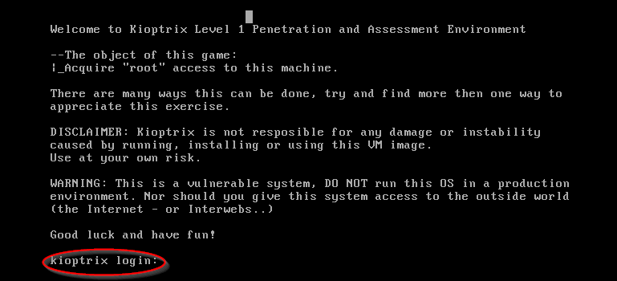
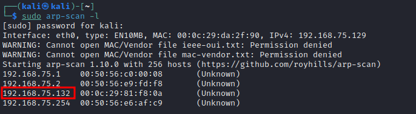
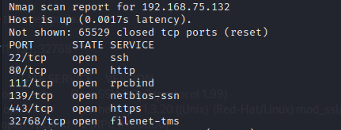
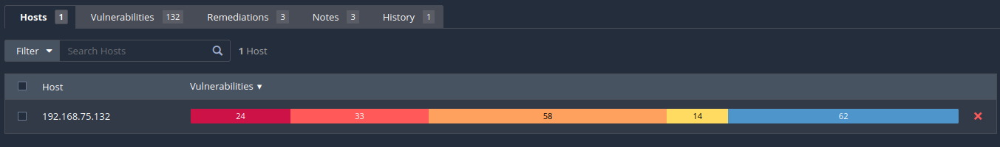
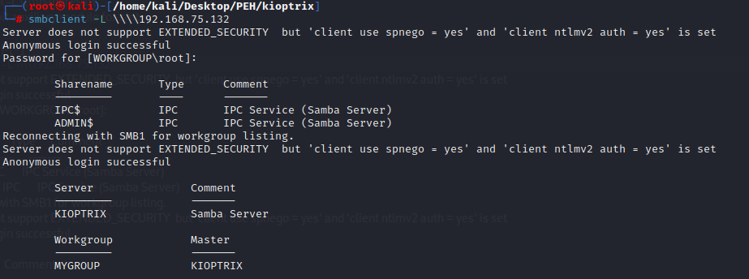
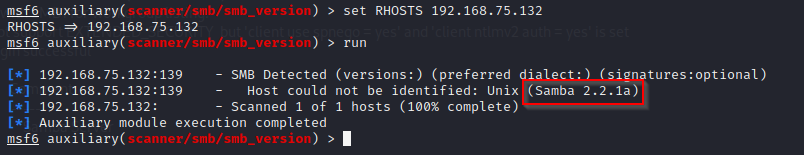
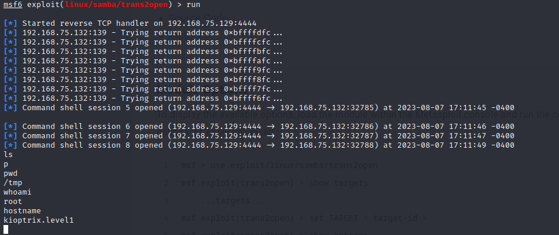
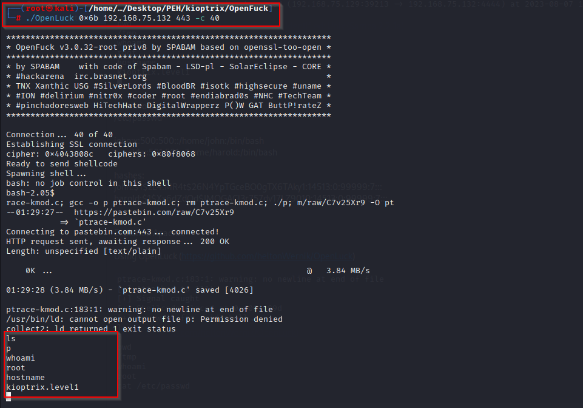

# Kioptrix (Level1)

Download this machine from [here](https://drive.google.com/drive/folders/1CsGWRsmyJm84TAU6U0-72o4Jnb5E9xvs).

Once boot up is successful, below login screen will appear:

 

**Active & Passive Scanning:**
* This victim machine needs to be on NAT network and attacker machine needs to be on the same network as well.
* Host discovery can be done using following commands:
> netdiscover -r "network address"  
> arp-scan -l

* Nmap scan results:

> nmap -sS -T4 -p- 192.168.75.132 -v 

* Performed service version detection, script-scanning and OS detection using -A switch as follows:

> nmap -sS -T4 -p22,80,111,139,443,32768 -A -v 192.168.75.132

Service discovery shows following results:

| PORT      | STATE | SERVICE     | VERSION
| --- | --- | --- | --- | 
| 22/tcp    | open  | ssh         | OpenSSH 2.9p2 (protocol 1.99)
| 80/tcp    | open  | http        | Apache httpd 1.3.20 ((Unix)  (Red-Hat/Linux) mod_ssl/2.8.4 OpenSSL/0.9.6b)
| 111/tcp   | open  | rpcbind     | 2 (RPC #100000)
| 139/tcp   | open  | netbios-ssn | Samba smbd (workgroup: MYGROUP)
| 443/tcp   | open  | ssl/https   | Apache/1.3.20 (Unix)  (Red-Hat/Linux) mod_ssl/2.8.4 OpenSSL/0.9.6b
| 32768/tcp | open  | status      | 1 (RPC #100024)

* Port 80 and 443 is open, therefor performed a quick **nikto** scan on this host, results are attached below:

[Nikto Results](nikto.txt)

Below are the findings:
* +Server: Apache/1.3.20 (Unix)  (Red-Hat/Linux) mod_ssl/2.8.4 OpenSSL/0.9.6b
* +Apache/1.3.20 - Apache 1.3 below 1.3.29 are vulnerable to overflows in mod_rewrite and mod_cgi.
* +mod_ssl/2.8.4 - mod_ssl 2.8.7 and lower are vulnerable to a remote buffer overflow which may allow a remote shell.

Performed a vulnerability scan using Nessus and found plethora of information :)

* While scanning smb port, observed there are two shares available:

It's possible to connect to IPC share but not on Admin share. Also on IPC share it was not possible to do anything.

* Using metasploit's auxiliary scanner trying to find more details on smb

A quick Google search shows that this version of Samba is a bad news :)

Further details can be found here on Rapid7 [website](https://www.rapid7.com/db/modules/exploit/linux/samba/trans2open/)

**Exploitation Using Metasploit:**
  
* During scanning phase, it was discovered that this machine is running Linux. Therefor using below metasploit exploit to check.
>  exploit/linux/samba/trans2open  
* While testing with default staged payload, observed multiple failures during initiating meterpreter session. Therefor using the non-staged payload.

**Manual Exploitation**

* A little digging yeilds out that Apache/1.3.20 and mod_ssl 2.8.4 are vulnerable. While searching about them, found **OpenLuck** github repository. 
* Usage is straightforward and steps are mentioned [here.](https://github.com/heltonWernik/OpenLuck)

**Recommendations:**
* Upgrade Apache and Samba to latest version.
* Remove or modify any banners that contain sensitive information about a system, such as software and version numbers.
